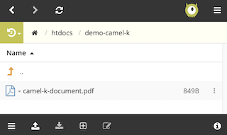

## Camel K demo: PDF Service

To have Camel K up and running, follow the installation instructions here: 
[*Camel K Installation*](https://github.com/apache/camel-k#installation)

1. Start with a simple demo showcasing sub-second start-up with a simple route like this:

    ```xml
    <route>
        <from uri="timer:tick"/>
        <log message="Hello from Camel K">
    </route>
    ```

1. Then run the Camel route with the following command:

        kamel run routes.xml --dev

    The execution will show log traces every second.

1. Update the source file with the following change:

    ```xml
        <log message="Hello from Camel K version 2.0">
    ```

    The logs will now show the new changes.

1. Now complete the PDF service flow by copying the Camel definition from the Fuse demo. Everything remains as-is, except for the `from` element and a `dataformat` command. The route definition should initiate looking like:
    ```xml
    <from uri="platform-http:/add"/>
    <to uri="dataformat:json-jackson:unmarshal"/>
    ```

1. Once the logic is completed, run the integration with the following command:

        kamel run routes.xml --dev -d camel-jackson

1. Once running, open a new terminal and fire a request with the following curl command:

    ```shell
    curl -X POST --header 'Content-Type: application/json' --header 'Accept: text/plain' -d '{  "docName":"camel-k-document", "docContent":"from Camel K secret content" }' 'http://`oc get route routes -o jsonpath='{..spec.host}'`/add'
    ```

If successful, you should find the PDF document uploaded in the FTP Server:


