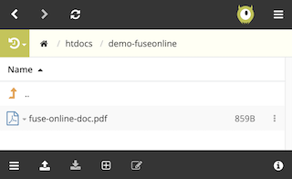

# FuseOnline demo: PDF Service

## Prerequisites:

 - ### FTP server

    To run the demo it's required to have ready an FTP server where the integration can point to.

    We've tested the demo using as an FTP endpoint the one provided by the following free online service:

    [https://app.infinityfree.net/login](https://app.infinityfree.net/login)

    If you don't have an FTP server available we suggest you to register and use the same service.

 - ### 2. Apicurito

    Apicurito is a web based tool included in OpenShift to design OpenApi definitions (REST APIs). If you don't have access to it in your OpenShift environment, ask the administrators to provision one and grant you access.


---

## 1. Create the API definition

* The integration follows an API-driven approach, therefore the REST API needs to be defined first.

    From OpenShift, open Apicurito's dashboard, and select '**New API**'.

    Hover over the API title and click the pen to redefine the name of the API to '`PDF service`'

    

    Next, add a Data Type which will define the payload to be sent to consume the service. Name it '`Document`' and add the following description:

        adds a Document

    Then enter the following JSON example:

    ```json
    {
        "docName":"sampleName",
        "docContent":"sample document content"
    }
    ```
    And click '**Save**'

    Now add a path, for simplicity define it as:
    
        /add
    
    When the path has been added, create a `POST` operation with the summary '`adds a Document`' and then click on the button with the verb '`POST`':

    

    Define the Operation Id as:

    

    Select the data type '`Document`' as the request body:

    

    and 200 as the response code:

    

    Finally, click on the API title to return back to the full definition, and switch from the Design view to the Source view where you should see the JSON definition of the constructed API.
    
    Then add the following tag and click '**Save**':
    
    ```yaml
    schemes:
        - http
    ```
    It should look as follows:

    

    This helps to invoke the service from a Swagger client.

    The API is now fully defined, from the top right corner, save the spec as JSON

    

---

## 2. Import FuseOnline extension

* FuseOnline has many Connectors available, however the PDF Converter does not come out-of-the-box, so we will proceed to import a custom step into FuseOnline which was designed with the capability of including custom extensions based on Camel definitions.

    The PDF Converter is included in the Demo, so we just need to compile it and import it.

    Open a terminal and head to the following directory:

        fuse-online/syndesis-extension-pdf

    Then run the following Maven command to build and package the extension:

        mvn clean package

    > **Note:** at the time of writing, there was a problem reported when building with Maven 3.6.0, ensure you use a lower Maven version.

    Once done, open FuseOnline's Dashboard and select:

    * Customizations > Extensions > Import Extension

    Then open the JAR generated in the previous step which should be located under:

        target/pdf-converter-1.0.0.jar

    and click **'Import Extension'**.

    You should see the PDF converted loaded into FuseOnline as shown below:

    


---

## 3. Define the FTP Connection

* Before we can define the integration process, the FTP connection needs to be set up using the FTP server connectivity details.

    If you're using the suggested online free service, you can find the details once you logged in, as shown in the picture below:

    

    Navigate in FuseOnline to:

    * Connections > Create Connection

    and select the FTP connector:

    

    Enter the connectivity details of your FTP server and click **'Validate'**. If successful, name the connection 'PDF Repository', and click **'Create'**.

    The connection should now be listed in your dashboard:

    

---

## 4. Create the Integration process

*  Navigate in FuseOnline to:

    * Integrations > Create Integration

    and select as a Starting activity **'API Provider'** since we want to expose a REST API for clients to consume.

    

    The default action prompted is to upload an OpenApi file which we have from having defined one with *Apicurito*. Select the previously created file and click **Next**.

    You can ignore the warning and click **Next** again. Name the service **'PDF Service'**, and hit the **'Save and continue'** button.

    FuseOnline will parse the API definition and will inmediately prompt you to select the POST openration pending to be implemented:

    
    
    Click on it to resume defining the process.

    On the left pane you'll find the process flow, click on the plus symbol to create a step.

    

    Select the PDF converter:

    

    A warning will show, click on it, and select **'add a data mapping step'**

    

    Then a Data Mapping tool will show, and you need to complete the following links from the input JSON Document to the target **`PdfConverter`**:

    * docName > filename
    * docContent > content

    

    Click **Done**.

    Now, following the PDF Conversion activity, include a new step selecting the **PDF Repository**, and confirm it is an '**Upload**' action by clicking on it.

    Complete the configuration for the FTP activity with the following values:

    | Field:  | Value |
    |-----------------------|------|
    | FTP directory:  | `/htdocs/demo-fuseonline` |
    | File name expression: | `${header.filename}` |

    > **Note** the file name is not hardcoded, we've selected the header name that was automatically set by the PDF Converter, mapped from the JSON input.

    Click **Next**. You can ignore the Input Data configuration and click **Next** again.

    The process definition should now be complete, and only pending to be published.

    Click '**Publish**' to initiate its deployment. Behind the scenes, FuseOnline will automatically translate the process into a Camel based project, then build and deploy in a container.

## 5. Create an OpenShift route to test the service.

*  When FuseOnline finishes publishing the service, it is still not exposed to external traffic. An administrator needs to create an OpenShift route to make the service consumable by external entities.

    As an administrator log into OpenShift, locate the FuseOnline service deployed by FuseOnline, and create a route.

    Once the route created, copy the URL to the clipboard. 
    
    You should see a pod view similar to the following with the route URL included:

    

    You can now open a Swagger client and explore the service's OpenApi definition using the route URL that should look like:

        http://{route-url}/openapi.json

    Using Swagger's Chrome extension you should see the following:

    

    Expand the operation and click the example data:

    

 
    Modify the JSON payload as follows to send a test request:

    ```json
    {
        "docName":"fuse-online-doc",
        "docContent":"fuse-online document content"
    }
    ```
    then click on the button '**Try it out!**'.

    > **Note** sometimes Swagger is a bit temperamental, if it doesn't work, then just execute the equivalent curl command, as follows:

    ```shell
    curl -X POST "http://localhost:8080/add" -H "accept: application/json" -H "Content-Type: application/json" -d "{ \"docName\":\"fuse-online-doc\", \"docContent\":\"fuse-online document content\"}"
    ```
    
    If the execution worked, you should see the PDF document uploaded in the FTP server.

    If you're using the suggested free online FTP service, open the file manager clicking the button abobe the FTP connection details:

    

    and navigate the newly created directory inside '`/htdocs`'

        /htdocs/demo-fuseonline

    Inside the folder you should find the uploaded PDF document.

    

    To validate the content of the PDF document, download it and open it, you should see the following:

    

---

The citizen integrator at this point should be proud of having implemented a full FuseOnline integration and have it deployed and tested in OpenShift.
