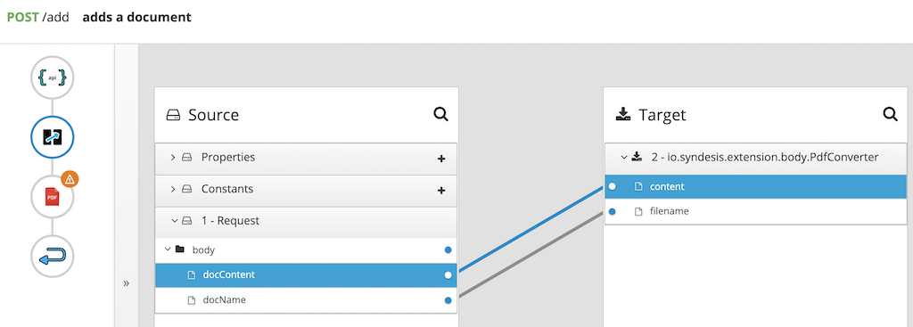

# PDF Converter Extension

This is a FuseOnline Extension to format the body to a PDF document.

The extension does not require configuration on the step definition, however it requires a Data Mapper in front to set the PDF content, and to set the name of the document into a header called 'filename':

