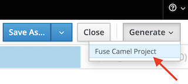
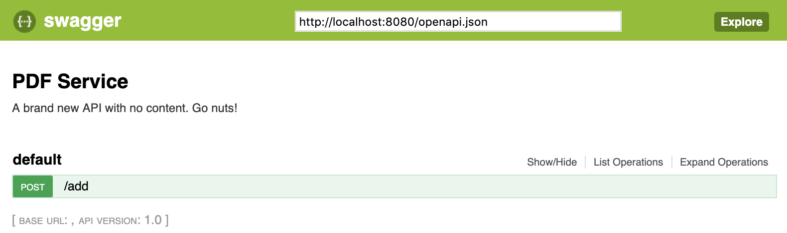
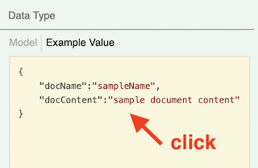
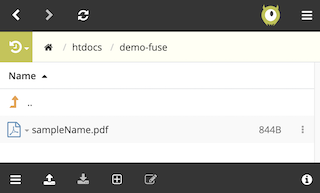
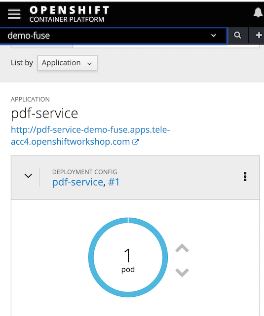
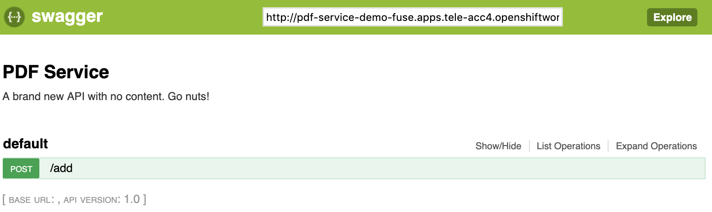
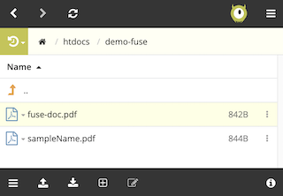

# Fuse demo: PDF Service

This demo follows the FuseOnline one, also based on the same integration definition (PDF Service).
It means, this demo relies on the OpanApi service defined in Apicurio previously with FuseOnline.

1. From Apicurio, generate the Camel project by selecting in the upper right corner "**Generate > Fuse Camel Project**" as shown below:

    

1. Save, then uncompress the generated ZIP file in your local filesystem.

    > **Note**: The auto-generated project includes a Camel REST DSL definition based on the API defined. The developer just needs to fill the gaps, as by default all services are wired with the error `'not implemented'`.

1. Once done, open the project with your IDE of choice and edit the OpenApi spec for a minor adjustment under:

    `src/main/resources/openapi.json`

    and include the following tag (after the `"info"` tag):

    ```json
    "schemes" : [ "http" ],
    ```
    this allows the Swagger client to test the service.

1. As the integration flow intends to format in PDF and upload to an FTP server, we need to include both dependencies in the POM file located in the root folder:

    `pom.xml`

    Include the following Camel dependencies:

    ```xml
    <dependency>
        <groupId>org.apache.camel</groupId>
        <artifactId>camel-pdf</artifactId>
    </dependency>
    <dependency>
        <groupId>org.apache.camel</groupId>
        <artifactId>camel-ftp</artifactId>
    </dependency>
    ```

1. Now the integration flow can be completed, edit the CamelContext located under:

    `src/main/resources/spring/camel-context.xml`

    and find the Route that implements the operation ID defined in Apicurio. In the demo it was defined as '`addDocument`'.

    The JSON fields from incoming requests can be extracted with the following *Simple* expression:

        ${body.get('field')}

    The final route definition should look similar to:

    ```xml
    <route>
        <from uri="direct:addDocument"/>

        <log message="got request"/>

        <setHeader headerName="CamelFileName">
            <simple>${body.get('docName')}.pdf</simple>
        </setHeader>

        <setBody>
            <simple>${body.get('docContent')}</simple>
        </setBody>

        <to uri="pdf:create"/>

        <to uri="ftp://ftpupload.net:21//htdocs/demo-fuse?passiveMode=true&amp;password=auZFRv8RAoC&amp;username=epiz_24054571"/>

        <setBody>
            <simple>done</simple>
        </setBody>

    </route>
    ```

    > **Note** the FTP destination folder is now pointing to `demo-fuse` where the PDF should be uploaded.

1. When the route has been fully defined, we can test locally to check the service works as expected.

    Open a terminal and from the project's root folder run the following command to start the Fuse instance:

        > mvn

    This should spin a SpringBoot based application, by default listening on port `8080`.

    You can now open a Swagger client and import the OpenApi definition using the following URL:

        http://localhost:8080/openapi.json

    Using Swagger's Chrome extension you should see the following:

    

    Expand the operation and click the example data:

    

    then click on the button '**Try it out!**'.

    > **Note** sometimes Swagger is a bit temperamental, if it doesn't work, then just execute the equivalent curl command, as follows:

    ```shell
    curl -X POST "http://localhost:8080/add" -H "accept: application/json" -H "Content-Type: application/json" -d "{ \"docName\":\"sampleName\", \"docContent\":\"sample document content\"}"
    ```

    If the execution worked, you should see the PDF document uploaded in the FTP server:

    


1. At this point the Developer should be happy with the local test and proceed to have the Fuse integration deployed in OpenShift.

    Create a new namespace in OpenShift, for example, by running the oc (openshift client) command:

        oc new-project demo-fuse

    Then, simply run the following command to deploy your Fuse integration into the newly created namespace:

        mvn fabric8:deploy

    Fuse provides the Fabric8 Maven plugin to make it easy to interact with OpenShift and deploy applications.

    After the build completes in OpenShift, it should roll out and start a new pod where Fuse runs.

    


    To try it out, copy the OpenShift HTTP route's URL, and from your Swagger client, obtain the OpenApi spec to trigger a request. The URL should look like:

        http://{route-url}/openapi.json

    

    Use the following payload to send a test request:

    ```json
    {
        "docName":"fuse-doc",
        "docContent":"fuse document content"
    }
    ```

    If successful, you should see now in the FTP server both PDFs (the local test, and openshift test) uploaded:

    

---

The developer at this point should be proud of having implemented a full Fuse integration and have it deployed and tested in OpenShift.


    


