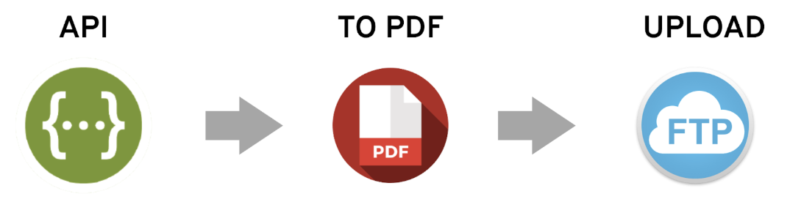
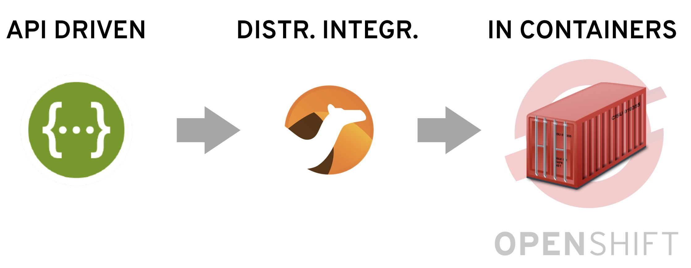

# *'Agile Integration'* demos: 
## PDF Service

This set of 3 demos will guide you to build integration processes that expose a REST API to allow consumers to post a Document payload in JSON format, then convert it into a PDF document and finally upload to an FTP server.

The implementation of each demo follows an API-driven approach, where the OpenApi specification of the service is defined first (the contract) driving the implementation to ensure it is fully compliant with the API definition.

All 3 demos define the same process above described, but simulating different personas: 

 - as a Citizen Integrator using *FuseOnline*
 - as a traditional developer with *Fuse*
 - using Camel K (Future tech., future persona?)

The 3 keys to enable '*Agile Integration*' are: APIs, Distributed Integrations, and Containers. We call them the 3 pillars of '*Agile Integration*'. The demos embrace the 3 pillars concept, by:
 1. following an API-driven approach.
 2. deploying required integrations only where needed.
 3. running them in containers.

 The goal of covering these three different methodologies is to showcase how the lightness and agility of the frameworks used allows creating different tooling and products to suit different user profiles and explore new horizons.

 The Demos are designed to be followed in the suggested order below, click on the links to access each one of the them:

 1. [*FuseOnline* Demo](fuse-online/readme.md)
 1. [*Fuse* Demo](fuse/readme.md)
 1. [*Camel K* Demo](camel-k/readme.md)

    

