# Fuse tooling with VSCode and AtlasMap

The following tutorial will help you to familiarise with Red Hat's VSCode tooling to create simple and composed data mappings.

- **Simple** data mappings cover scenarios where for instance you're invoking a backend system, and you'd like to apply some data transformation before you respond.

- **Composed** data mappings cover scenarios where you interact with multiple backend systems and you need to aggregate the data in a single data structure.

For simplicity the tutorial will focus attention on the data mappings and mock the target systems.

</br>

## Prerequisites

The tutorial uses VSCode which you can download from: \
[https://code.visualstudio.com/download](https://code.visualstudio.com/download)

Also, the following VSCode Extensions are required to be preinstalled:

 - XML Language Support by Red Hat
 - Language Support for Apache Camel by Red Hat
 - Extension Pack for Apache Camel by Red Hat
 - AtlasMap Data Transformation editor by Red Hat

Using the filter 'Red Hat' you can find them from VSCode extensions search bar:

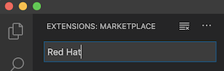

</br>

## Prepare a new Fuse project

Open a terminal, and from your selected working folder create a new Fuse project using the following *Maven* command:

    mvn org.apache.maven.plugins:maven-archetype-plugin:2.4:generate \
    -DarchetypeCatalog=https://maven.repository.redhat.com/ga/io/fabric8/archetypes/archetypes-catalog/2.2.0.fuse-740017-redhat-00003/archetypes-catalog-2.2.0.fuse-740017-redhat-00003-archetype-catalog.xml \
    -DarchetypeGroupId=org.jboss.fuse.fis.archetypes \
    -DarchetypeArtifactId=spring-boot-camel-xml-archetype \
    -DarchetypeVersion=2.2.0.fuse-740017-redhat-00003

> **Note:** We chose an XML DSL based project, as it contains the whole Camel definition in a single source file, and can be friendlier for java beginners.

Enter the requested Maven coordinates, for example:

    Define value for property 'groupId': : org.demo
    Define value for property 'artifactId': : datamap    
    Define value for property 'version': : 1.0.0

</br>

## Create a simple Data Transformation

On this first example, we simulate obtaining the details of an individual from a backend system in XML format, and we intend to transform to a different JSON based data structure.

The first thing to do is to prepare the sample data files AtlasMap (the mapping tool) requires so that we can work on the mapping defition.


Create the following file under:

    src/main/resources/data/individual.xml

with the following content, which represents the source data:

```xml
<Individual>
    <Name>Some</Name>
    <Surname>One</Surname>
    <Address>
        <Number>1</Number>
        <Street>Some Street</Street>
        <City>Somewhere</City>
        <PostCode>SOME C0D3</PostCode>
        <Country>UK</Country>
    </Address>
</Individual>
```

> **Note:** this file will serve both as a Data Shape model (design time) for AtlasMap, and also will be used as the mock source data (execution time).

</br>

Create the following file under:

    src/main/resources/data/individual.json

with the following content, which represents the destination data:

```json
{
    "fullName":"",
    "addressLine1":"",
    "addressLine2":"",
    "addressLine3":""
}
```

Now that both in/out data shapes are available we can define the data mapping definition.

Launch AtlasMap in VSCode from *View -> Command Pallette...* \
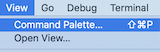

And select the AtlasMap tool: \
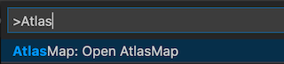

After few seconds a new tab should popup with the AtlasMap viewer.

Now follow the steps below to complete the mapping definition

1. On the *Source* column, click on the icon to "Import..." \
   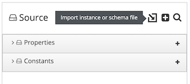

   and select the XML individual file previously created.


1. On the *Target* column, click on the icon to "Import..." \
   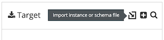

   and select the JSON individual file previously created.

1. Click on the field 'Name' on the left, then click *'fullName'* on the right, this should give you: \
   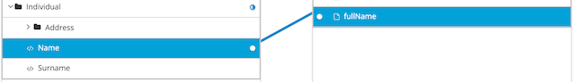


1. Now, press the key <kbd>Ctrl</kbd> (on Mac <kbd>&#8984;</kbd>) and click on the field *'Surname'* on the left, resulting in: \
   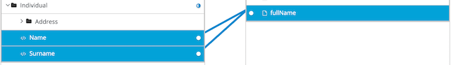

   This action combines both source fields into the same target field with the 'space' separator.

2. Continue completing the rest of the mapping definition following the table below:

   | Source                    | Target       |
   | :---                      | :---         |
   | Address/ Number + Street  | addressLine1 |
   | Address/ City + PostCode  | addressLine2 | 
   | Address/ Country          | addressLine3 | 
    
    The complete mapping definition should look similar to: \
    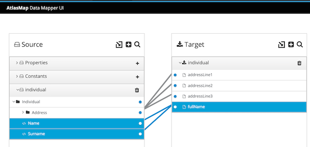

1. Finally, export the mapping to have it included in the project: \
   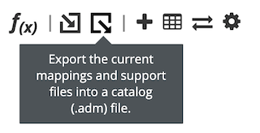

   Save the *'adm'* file into the following project folder:

        src/main/resources/map/simple-mapping.adm

</br>

The data mapping work is done, let's complete the project with the following steps:

1. Include the AtlasMap dependency in your POM.XML file:

    ```xml
    <dependency>
        <groupId>io.atlasmap</groupId>
        <artifactId>camel-atlasmap</artifactId>
        <version>1.42.4</version>
    </dependency>
    ```

2. Delete the default *Camel* route generated by *Maven*, and include the Camel route definition that will execute the mapping.

   Your complete *CamelContext* definition should look like:

    ```xml
    <camelContext id="camel" xmlns="http://camel.apache.org/schema/spring">

        <route>
            <from uri="timer:simple?repeatCount=1"/>
            <to uri="language:constant:resource:classpath:/data/individual.xml"/>
            <to uri="atlas:map/simple-mapping.adm"/>
            <log message="result is:\n ${body}"/>
        </route>

    </camelContext>
   ```

   The code above:
   1. triggers a process only once (repeatCount=1)
   2. then loads a file resource (simulating the obtention of an XML payload)
   3. then triggers the data mapping
   4. and finally prints out the result  

   
   </br>
   
   **Please note** how the Red Hat VSCode extensions can help you building your code using auto-completion as you type your Camel XML DSL: \
   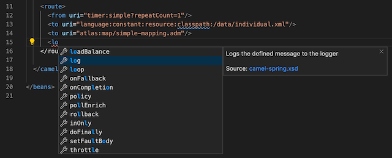
   
   > **Tip:** auto-completion might be prefixing all instructions with the namespace `camel:`. To make auto-completion to use plain keywords (from, to, log, ...) simply remove the namespace from the Spring XML declaration, delete the entry: \
   `xmlns:camel="http://camel.apache.org/schema/spring"`
   
   

   </br>

## Run the simple Data Transformation

From the terminal, run Maven from the root of the project:

    > mvn

The above command should launch the application and execute the Camel route once. The log output should show the resulting output of the mapping execution. Below we show a pretty-printed version:

```json
{
    "fullName":"Some One",
    "addressLine1":"1 Some Street",
    "addressLine2":"Somewhere SOME C0D3",
    "addressLine3":"UK"
}
```

</br>

## Create a composed Data Transformation

On this second example, we simulate obtaining different data payloads from multiple endpoints aiming to aggregate it all in a single data structure. This is a very typical integration scenario where *Camel* and *Fuse* find their sweet spot.

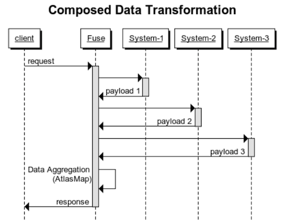

</br>

### Define your Camel routes

This time we start defining the Camel routes to have a full view of the end to end process.

Include one by one the following definitions in your *CamelContext*:

This would be the main route that matches well the illustration above:
```xml
    <route>
      <from uri="timer:composed?repeatCount=1"/>
      <to uri="direct:call-system1"/>
      <to uri="direct:call-system2"/>
      <to uri="direct:call-system3"/>
      <to uri="direct:map-response"/>
    </route>
```

For simplicity, the invocation to the backends will be stubbed. Each call is resolved in its own *Camel* route (invoked using Camel's component 'direct') and would be implemented as follows:

```xml
    <route>
      <from uri="direct:call-system1"/>
      <to uri="language:constant:resource:classpath:/data/customer.json"/>
      <setProperty propertyName="atlasmap-source-1">
        <simple>${body}</simple>
      </setProperty>
    </route>

    <route>
        <from uri="direct:call-system2"/>
        <to uri="language:constant:resource:classpath:/data/subscription.xml"/>
        <setProperty propertyName="atlasmap-source-2">
          <simple>${body}</simple>
        </setProperty>
    </route>

    <route>
        <from uri="direct:call-system3"/>
        <to uri="language:constant:resource:classpath:/data/offer.xml"/>
        <setProperty propertyName="atlasmap-source-3">
          <simple>${body}</simple>
        </setProperty>
    </route>    
```

> **Note:** how each returned payload is safely kept in a dedicated property.

The final `direct` *Camel* route to execute the mapping would be implemented as follows:

```xml
    <route>
      <from uri="direct:map-response"/>
      <bean ref="helper" method="getMappingInputs"/>
      <to uri="atlas:map/composed-mapping.adm"/>
      <log message="result is:\n ${body}"></log>
    </route>
```

Note the line referencing the `helper` bean which will help us creating the *Java Map* object required by AtlasMap to pass multiple source inputs.

Define the `helper` bean (outside the *CamelContext*) in the Spring XML file as:

```xml
<bean id="helper" class="org.demo.Helper"/>
```

And define its implementing `Helper` class as:

```java
package org.demo;
import java.util.*;
import org.apache.camel.Exchange;
public class Helper {
    public Map getMappingInputs(Exchange exchange)
    {
        HashMap<String,Object> inputs = new HashMap<String,Object>();
        inputs.put("customer",   exchange.getProperty("atlasmap-source-1"));
        inputs.put("subscription", exchange.getProperty("atlasmap-source-2"));
        inputs.put("offer",        exchange.getProperty("atlasmap-source-3"));
        return inputs;
    }
}
```

Save the class under:

    src/main/java/org/demo/Helper.java

</br>

### Create the simulated payload samples

The Camel routes are attempting to load the payloads from the project resources. Let's ensure they are available.

Create the 'Customer' JSON resource under:

    src/main/resources/data/customer.json

and content:

```json
{
    "Name":"Bruno",
    "Surname":"Meseguer",
    "contact":"bruno.meseguer@redhat.com"
}
```

Create the 'Subscription' XML resource under:

    src/main/resources/data/subscription.xml

and content:

```xml
<Subscription>
    <id>10</id>
    <service>data</service>
    <expiryDate>31-12-2019</expiryDate>
</Subscription>
```

Create the 'Offer' XML resource under:

    src/main/resources/data/offer.xml

and content:

```xml
<Offer>
    <type>extension</type>
    <duration>1 year</duration>
    <discount>20%</discount>
</Offer>
```

</br>

### Define the composed Data Transformation

The example aims to compose a JSON target structure that will contain the data collected from all the different external systems (simulated).

Create the JSON data shape sample necessary for AtlasMap:

    src/main/resources/data/composed.json

```json
{
  "SubscriberDetails": {
    "customer": "",
    "email": "",
    "Package": {
      "uid": "",
      "expiry": "",
      "name": ""
    },
    "Renewal": {
      "length": "",
      "discount": ""
    }
  }
}
```


We can now define the data mapping definition.

Launch AtlasMap (if not already running) in VSCode from *View -> Command Pallette...* \


And select the AtlasMap tool: \


After few seconds a new tab should popup with the AtlasMap viewer.

If the mapper still shows an old mapping definition, click 'Reset All' to reset AtlasMap. \
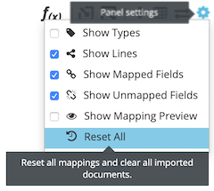

Now follow the steps below to complete the mapping definition

1. On the *Source* column, click on the icon to "Import..." \
   

   and select the XML subscription file previously created.

   Repeat the same action to load the XML Offer, and JSON customer sources.

   When done you should find the 3 source data shapes loaded:
    - subscription.xml
    - offer.xml
    - customer.json

   And the Source column should look like: \
   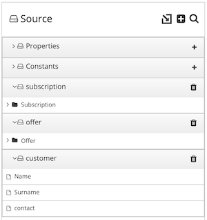


1. On the *Target* column, click on the icon to "Import..." \
   

   and select the JSON composed data shape previously created.

   The target panel should show the target structure: \
   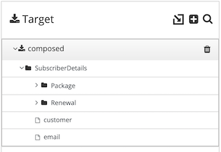

1. Map from left to right all the matching fields as follows:


   | Subscription | Package |
   | :---         | :---    |
   | expiryDate   | expiry  |
   | id           | uid     | 
   | service      | name    | 

   | Offer    | Renewal      |
   | :---     | :---         |
   | discount | discount     |
   | duration | length       | 
   | type     | (not mapped) | 

   | Customer       | SubscriberDetails |
   | :---           | :---              |
   | Name + Surname | customer          |
   | contact        | email             | 

    The resulting Mapping should look like: \
    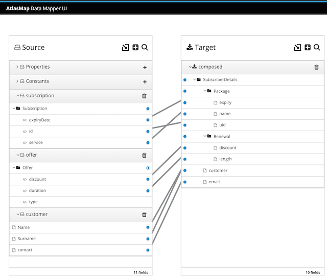

1. Finally, export the mapping to have it included in the project: \
   

   Save the *'adm'* file into the following project folder:

        src/main/resources/map/composed-mapping.adm

</br>


## Run the composed Data Transformation

From the terminal, run Maven from the root of the project with the command:

    > mvn

The above command should launch the application and execute the main Camel route once. The log output should show the resulting output of the mapping execution. Below we show a pretty-printed version:


```json
{
  "SubscriberDetails": {
    "Package": {
      "expiry": "31-12-2019",
      "uid": "10",
      "name": "data"
    },
    "Renewal": {
      "discount": "20%",
      "length": "1 year"
    },
    "customer": "Bruno Meseguer",
    "email": "bruno.meseguer@redhat.com"
  }
}
```

</br>

Et voilà !