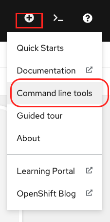
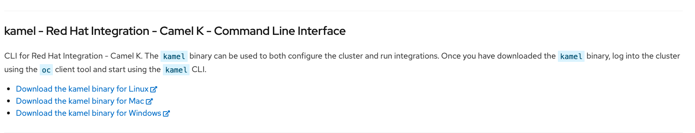

# Hands-on with Camel-K

##  Install Camel-K's Operator

The very first step into Camel-K is to install the Operator for Camel-K.

1. Login as a user to the environment (OpenShift's web console)

   You should have been provided with the lab URL with credentials similar to:

       username: {user}
       password: r3dh4t1!

   where `{user}` is your chosen/given username.

1. Create a new namespace using the web interface, or alternatively using the CLI:

   First you need to login via the CLI. Click in the web console your username at the top right corner and select `Copy Login Command`.

   

   You'll need to login again with your credentials. Then copy and paste in your terminal the `oc` login command.

   Now you can create your namespace as follows:

       oc new-project lab-{user}

1. Installing the Camel-K operator requires admin privileges (not necessary in future versions).

   > **`WARNING:`** This is a workaround measure, please perform these actions carefully as you could damage the environment and impact the entire lab session.

   Switch user, login as an admin with the following credentials:

       username: opentlc-mgr
       password: r3dh4t1!

   
2. From OCP, ensure you're on the new namespace `lab-{user}` and browse the catalogue to choose the CamelK operator

    

    click the `Install` button, and select the specific namespace  `lab-{user}` you just created for the lab:

    

    click the `Subscribe` button. This action should kick off the installation of the Camel-K operator, and after few moments you should see a pod deployed similar to the image below:

    

    > **`WARNING:`** At this point the admin installation is now complete, please logout.

    Login back to the system using your user credentials:

       username: {user}
       password: r3dh4t1!

    You should see the Operator pod running in your namespace, navigate to the _"Developer Catalog"_ menu and select to install a Camel _IntegrationPlatform_:

    

    And with the following YAML definition:

    ~~~yaml
    apiVersion: camel.apache.org/v1alpha1
    kind: IntegrationPlatform
    metadata:
      name: camel-k
      namespace: lab-{user}
      labels:
        app: camel-k
    ~~~

    where `{user}` is your chosen username.

    By this point your Camel-K should be fully operable.

 

---

## Install Camel-K client

Click in the webconsole the `+` sign at the top right corner and select `Commad line tools`

Download the Camel-K client that corresponds to your machine's architecture.

If on Mac or Linux unzip where desired its contents with the following command:

    tar zxvf <name of kamel cli tar>

Then, ensure you configure your path by executing the following command from where `kamel` is located:

    PATH=$PATH:$(pwd)

At this stage you should have both the client installed and the Camel-K operator in place. You should now be ready to run Camel-K integrations.

 

---

## Run a Camel-K integration

Various languages are supported to implement Camel routes when constructing Camel-K integrations.

For simplicity, on these first Camel-K steps you're doing, we'll use JavaScript.

It couldn't be simpler, create a Camel flow that uses a Timer that triggers every second (default period), and logs a message.

1. Create a file:

       tick.js

    which contains the following code:

    ~~~javascript
    from('timer:tick')
    .log('hello from Camel-K')
    ~~~

2. Ensure you're working on the new namespace where Camel-K's operator was deployed:

    ~~~shell  
    oc project lab-{user}
    ~~~

    where `{user}` is your chosen username.

3. Run the integration in `DEV` mode, by executing the following command:

    ~~~shell  
    kamel run --dev tick.js
    ~~~

    > **Be patient!** The first time you interact with Camel-k's operator it needs to run some initialisations, so it'll take some time.

    After the Operator is done, you should see in your terminal the logs of your Camel route. 

    > **Please note:** the integration is running remotely in a pod in OpenShift, the logs are being streamed to the terminal from the pod.

    

    and you'll see in OCP the new pod running your integration:

    

4. Now, without stopping the process in your terminal, make a change on your route definition and save the file, for example:

    ~~~javascript
    from('timer:tick')
    .log('hello from Camel-K, Version 2.0')
    ~~~

    Because you're running in DEV mode (`--dev`) the `kamel` client will pick up and push the changes that take immediate effect. Your logs should show the traces corresponding to the new version:

    

    Behind the scenes, Camel-K's operator has destroyed the previous POD and launched a new one with the latest changes, all within just few seconds.

5. Stop now your instance with <kbd>ctrl</kbd>+<kbd>c</kbd> in your terminal. You will notice how the POD running in DEV mode got destroyed in OCP.

 

## Deploy a Camel-K integration

We've seen previously how to run in DEV mode. Now we simply want to deploy the integration permanently.

The command is the same, without that parameter `--dev`. Optionally you can provide a custom name to the deployed integration:

    kamel run --name hello tick.js

a new pod prefixed with the name hello will be launched by the operator.

You can obtain the list of deployed integrations by running the command:

    kamel get

Alternatively, you can run the `oc` command:

    oc get integrations

Both should display on screen your deployed integration:

    NAME    PHASE     CONTEXT
    hello   Running   

 

## Un-deploy a Camel-K integration

To delete an existing integration:

    kamel delete hello

Alternatively, you can run the `oc` command:

    oc delete it hello

> **Please note:** the keyword `it` is an abbreviation of the keyword `integration`.

 

---

Click the link to the [Next](./lab02.md) chapter when ready. 
